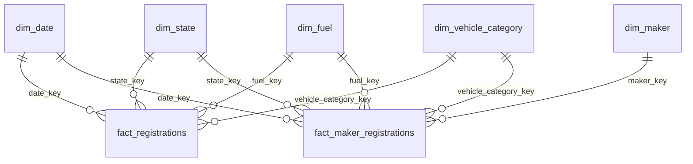
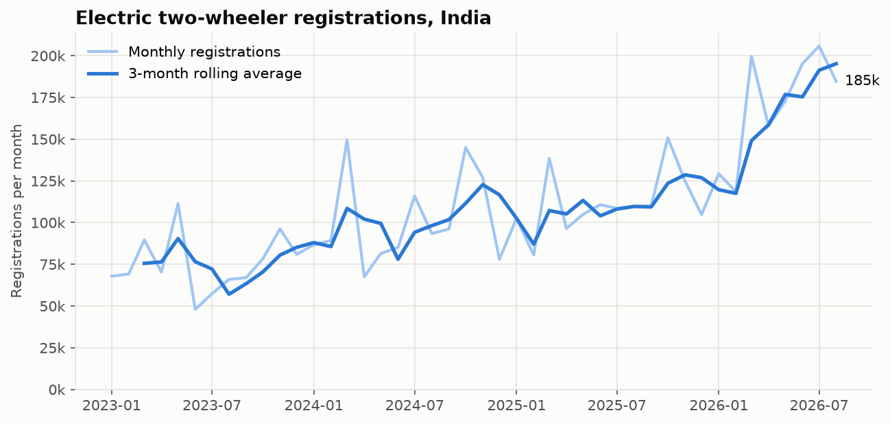
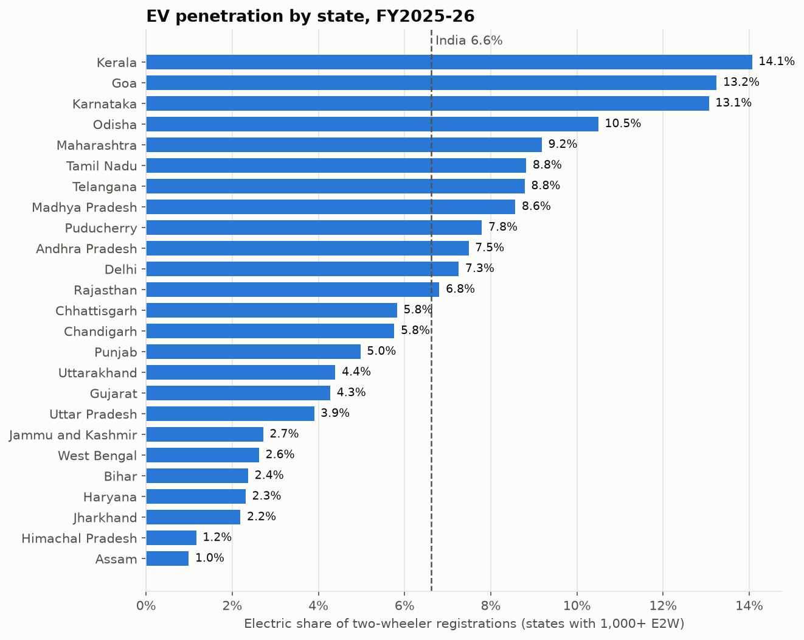
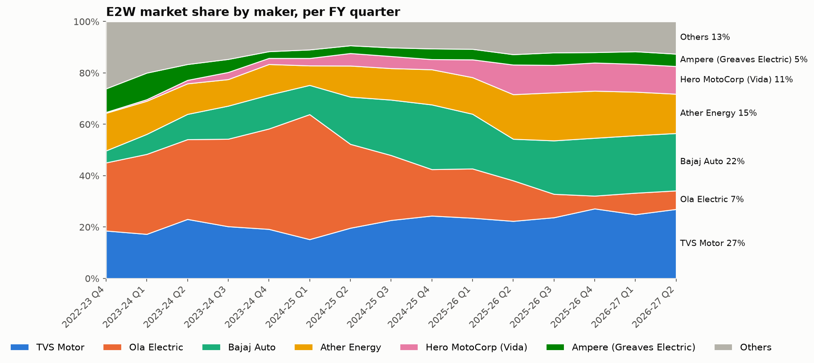
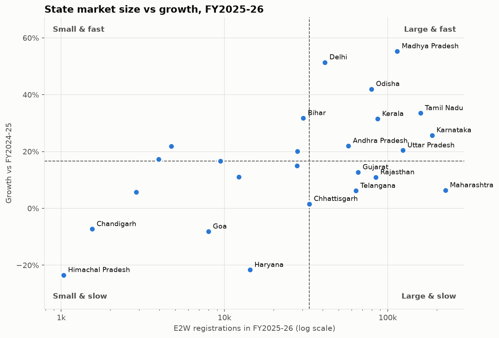
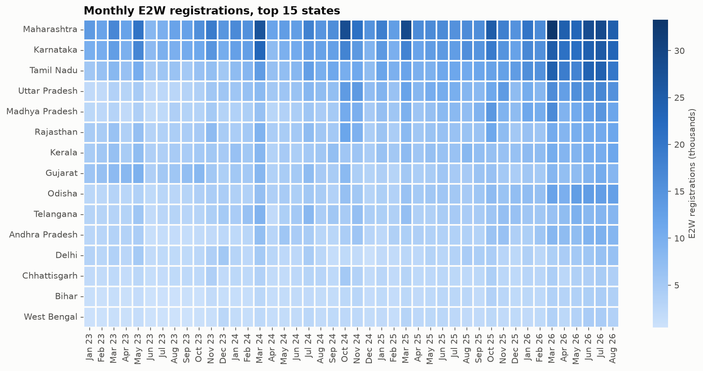
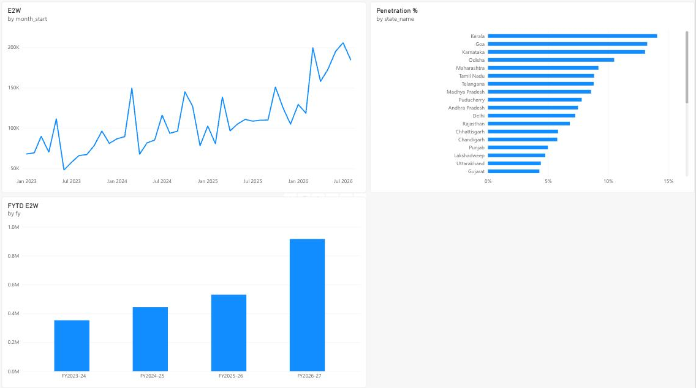
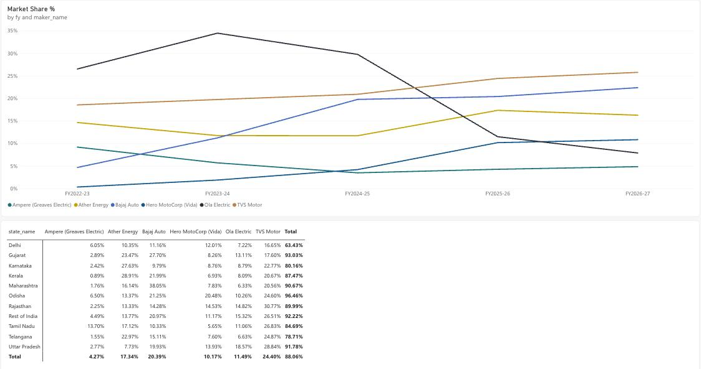
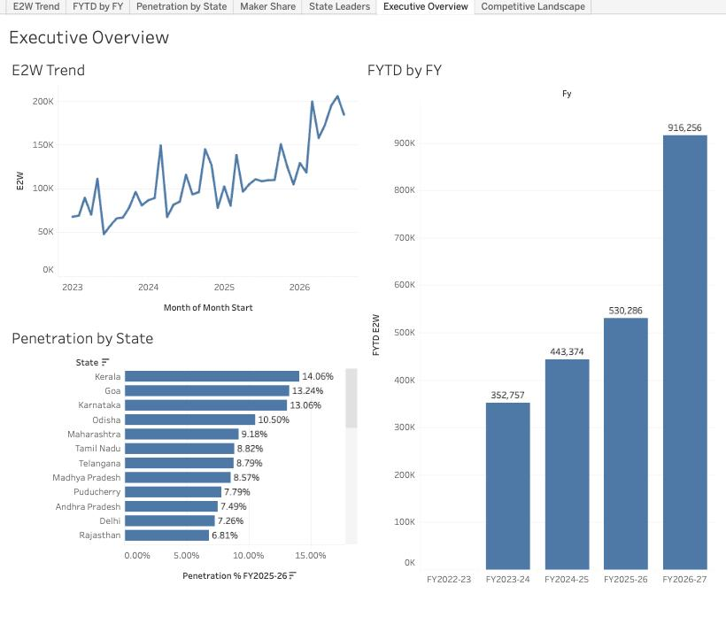
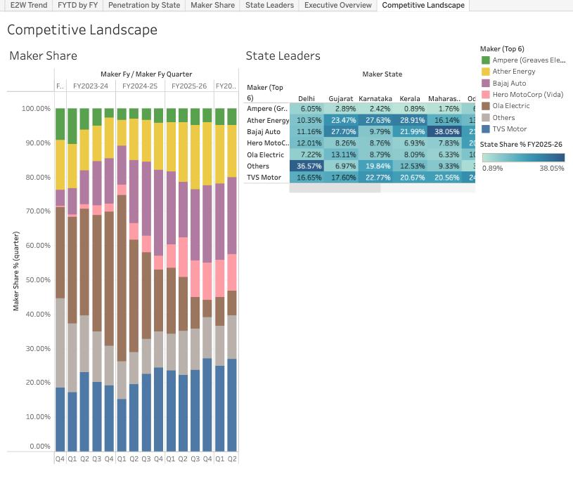

# India EV Adoption & Market Share Analysis

Where should an electric two-wheeler brand expand in India? An end-to-end analysis of 3.6 years of Vahan registration data across all 36 states and UTs, from raw government exports to a PostgreSQL star schema, SQL analysis and dashboards.


[](https://public.tableau.com/app/profile/mainak.das6780/viz/IndiaEVAdoptionMarketShare/ExecutiveOverview)

## Business problem

Framed as a consulting engagement for a two-wheeler EV brand planning to expand. Leadership asked:

> How fast is EV adoption growing, in which states, who holds market share where,
> and which states should we prioritise next?

## Data sources

| Data | Source | Coverage |
|---|---|---|
| Vehicle registrations | [Vahan dashboard](https://vahan.parivahan.gov.in/vahan4dashboard/vahan/view/reportview.xhtml), downloaded manually | Jan 2023 - Aug 2026, 36 states/UTs, monthly |
| State population | Population Projections for India and States 2011-2036 (National Commission on Population, MoHFW), Table 14 | Projection as on 1 Oct 2025 |
| State regions | Grouped by MHA Zonal Councils; Northeast = the eight North Eastern Council states | 36 states/UTs |

How to download the Vahan files, with exact filter settings: [`data/raw/README.md`](data/raw/README.md).

Definitions:
- **Two-wheeler (2W)**: Vahan vehicle categories TWO WHEELER(NT), TWO WHEELER(T), TWO WHEELER (Invalid Carriage)
- **Electric two-wheeler (E2W)**: 2W with fuel ELECTRIC(BOV) or PURE EV (Vahan uses both labels)
- **EV penetration %**: E2W registrations / all 2W registrations
- **Financial year**: April to March (FY2025-26 = Apr 2025 - Mar 2026)

## Data dictionary

| Table | Grain | Columns |
|---|---|---|
| `fact_registrations` | state x month x fuel group | `date_key`, `state_key`, `fuel_key`, `vehicle_category_key`, `registrations` |
| `fact_maker_registrations` | state x month x maker (E2W only) | `date_key`, `state_key`, `maker_key`, `fuel_key`, `vehicle_category_key`, `registrations` |
| `dim_date` | month | `date_key` (YYYYMM), `month_start`, `calendar_year`, `month_no`, `month_name`, `fy`, `fy_start_year`, `fy_quarter`, `fy_month_no`, `is_festive` (Sep-Nov) |
| `dim_state` | state | `state_key`, `state_name`, `vahan_name`, `region`, `population`, `has_maker_data` |
| `dim_maker` | Vahan maker name | `maker_key`, `maker_raw`, `maker_name` (standardised), `parent_group` |
| `dim_fuel` | fuel group | `fuel_key`, `fuel_group` (Electric / Non-electric), `is_electric`, `vahan_fuels` |
| `dim_vehicle_category` | category | `vehicle_category_key`, `category_name`, `vahan_categories` |

`fact_maker_registrations` holds state-level rows for states with maker data plus a "Rest of India" row
(national total minus those states), so it always sums to the national figure.

## Data model



Two fact tables because Vahan only exports two-dimensional pivots (state x month, or maker x month),
so each fact keeps the grain its source reports actually have.

## Methodology

1. **Collect**: Vahan "Month Wise" reports per calendar year (FY is derived from the month in code).
2. **Combine** (`src/combine_raw.py`): parses multi-row headers, converts Indian-format numbers
   (`25,11,130`), reshapes wide months to long, checks each row against Vahan's TOTAL column, maps state
   names, and cross-checks reports against each other to catch files downloaded with the wrong filters.
3. **Load** (`src/load_to_postgres.py`): builds the star schema, drops the incomplete latest month,
   derives non-electric = all 2W - electric, and Rest of India = national - covered states.
4. **Validate** (`sql/02_validation.sql`): totals reconcile to the raw reports per state and month,
   maker totals match state totals, no orphan keys, negatives or duplicate grain rows. All 9 checks pass.
5. **Analyse** (`sql/03_analysis.sql`): 12 business questions with CTEs and window functions.
6. **Explore** (`notebooks/01_eda.ipynb`) and **visualise** in Power BI and Tableau from `data/processed/*.csv`.

## Highlight queries

FYTD registrations with YoY % for the same months of the previous FY:
```sql
fytd AS (
    SELECT *, SUM(e2w) OVER (PARTITION BY fy ORDER BY fy_month_no) AS fytd_e2w
    FROM full_start
)
SELECT cur.fy, cur.month_start, cur.fytd_e2w, prev.fytd_e2w AS py_fytd_e2w,
       ROUND(100.0 * (cur.fytd_e2w - prev.fytd_e2w) / NULLIF(prev.fytd_e2w, 0), 1) AS fytd_yoy_pct
FROM fytd cur
LEFT JOIN fytd prev
       ON prev.fy_start_year = cur.fy_start_year - 1
      AND prev.fy_month_no = cur.fy_month_no;
```

Market concentration (HHI) per state:
```sql
SELECT state_name, ROUND(SUM(share_pct * share_pct)) AS hhi
FROM shares
GROUP BY state_name;
```

Makers gaining or losing share, last 12 months vs the 12 before, and the state prioritisation
scorecard with a weight-sensitivity test: see Q9 and Q12 in [`sql/03_analysis.sql`](sql/03_analysis.sql).

## Screenshots








Power BI report (built in the Power BI service on the same star schema, with DAX measures for E2W,
penetration %, FYTD, market share and HHI):




Tableau Public dashboards:




## Key insights

- **Growth is accelerating.** E2W registrations rose from 1.00M (FY2023-24) to 1.47M (FY2025-26), about 21% a year.
  April-August 2026 is up 72.8% on the same months of 2025, and monthly penetration passed 10% for the first time in June 2026.
- **Adoption is uneven.** National penetration is 6.62% (FY2025-26), but Kerala, Goa and Karnataka are above 13%,
  while Uttar Pradesh is at 3.90% and Bihar 2.37%. The South is 38% of all E2W volume.
- **Leadership changed hands.** Ola's share peaked at 48.6% (Q1 FY2024-25) and fell to 11.5% for FY2025-26.
  TVS (24.4%), Bajaj (20.4%), Ather (17.3%) and Hero Vida (10.2%) now hold about 72% of the market.
- **Every state is a different market.** TVS leads 6 of the 10 largest states, Bajaj dominates Maharashtra (38%),
  Ather leads Kerala and Karnataka. Delhi is the most fragmented market (HHI 966), Maharashtra the most concentrated (2,245).
- **Festive season is a petrol story.** Sep-Nov lifts all two-wheeler registrations 45% above other months (FY2025-26), but E2W only 7%.

## Recommendations

Prioritise **Tamil Nadu, Karnataka and Delhi** first, then **Uttar Pradesh and Odisha**, based on a weighted scorecard
of market size, growth, penetration headroom and competition (Q12), tested under four weightings:

| Rank | State | E2W FY2025-26 | Growth | Penetration | HHI |
|---|---|---|---|---|---|
| 1 | Tamil Nadu | 158,628 | +33.5% | 8.82% | 1,493 |
| 2 | Karnataka | 186,685 | +25.7% | 13.06% | 1,577 |
| 3 | Delhi | 41,245 | +51.4% | 7.26% | 966 |
| 4 | Uttar Pradesh | 123,844 | +20.4% | 3.90% | 1,843 |
| 5 | Odisha | 79,511 | +42.0% | 10.50% | 1,804 |

Tamil Nadu is the most robust pick (2nd under every weighting). Maharashtra is the largest market but is held back by
6.4% growth and the most concentrated competition; its rank swings from 3rd to 9th with the weights.

## Challenges I faced

- **Unreliable source.** Vahan's Excel export failed intermittently (HTTP 503), and the old dashboard is being replaced
  by a portal that needs a CAPTCHA for every report, so all files were downloaded manually.
- **Exports don't record their filters.** 28 files were first downloaded without the two-wheeler and EV filters and looked
  fine on the surface. Cross-report checks in `combine_raw.py` (E2W must be a small share of all 2W; maker totals must
  equal state totals) caught every one.
- **Financial years.** Vahan's "Financial Year" option returned the same Jan-Dec table for monthly reports, so I downloaded
  calendar years and derived the FY from each month.
- **Two labels for electric.** Vahan records EVs as both `ELECTRIC(BOV)` and `PURE EV`; counting one would undercount.
- **Messy maker names.** Makers are listed by legal entity, with renames and spelling variants (Ampere Vehicles became
  Greaves Electric Mobility). I built a mapping to standard names and parent groups.
- **Mismatched grains.** Vahan only exports two-way tables, so the model uses two fact tables and a "Rest of India"
  bucket instead of forcing everything into one.
- **A partial first year.** The data starts in January, so the first FY has only three months; the FYTD comparison had
  to exclude it to avoid a false +1,000% growth figure.

## Links

- Tableau Public:
  - [Executive Overview](https://public.tableau.com/app/profile/mainak.das6780/viz/IndiaEVAdoptionMarketShare/ExecutiveOverview)
  - [Competitive Landscape](https://public.tableau.com/app/profile/mainak.das6780/viz/IndiaEVAdoptionMarketShare/CompetitiveLandscape)
- Power BI: report built in the Power BI service (private workspace); see the screenshots above.

## How to reproduce

Requires Python 3.11+ and PostgreSQL 15.

```bash
python3 -m venv .venv
source .venv/bin/activate
pip install -r requirements.txt

# create the database and user (once), then fill in DB_PASSWORD
psql postgres -c "CREATE USER ev_user WITH PASSWORD '<password>';"
psql postgres -c "CREATE DATABASE india_ev OWNER ev_user;"
cp .env.example .env

python src/check_connection.py      # prints "connected"
python src/combine_raw.py           # data/raw/*.xlsx -> data/interim/*.csv, profile and filter checks
python src/load_to_postgres.py      # builds and loads the star schema
psql -d india_ev -U ev_user -f sql/02_validation.sql
psql -d india_ev -U ev_user -f sql/03_analysis.sql
python src/export_for_bi.py         # data/processed/*.csv for Power BI and Tableau
jupyter lab notebooks/01_eda.ipynb
```

Power BI and Tableau both import the CSVs in `data/processed/` (`powerbi/theme.json` holds the Power BI colour theme).

## Project structure

```
data/raw/          Vahan exports (see data/raw/README.md)
data/reference/    state population, state-to-region mapping, maker-name mapping
data/processed/    star-schema tables as CSV for Power BI / Tableau
sql/               schema, validation and analysis queries
notebooks/         exploratory analysis
src/               combine, load, export and connection scripts
powerbi/           build guide, theme, report and PDF export
tableau/           build guide, link and screenshots
images/            charts and dashboard screenshots
reports/           insights summary
```

## What I'd do next

- Maker-level data for all states, and RTO (district) data inside the priority states
- Price-segment and model-level analysis to see where a new brand would compete
- Charging-station density and state subsidy policy as extra scorecard factors
- A monthly refresh: new Vahan downloads re-run the whole pipeline in minutes
